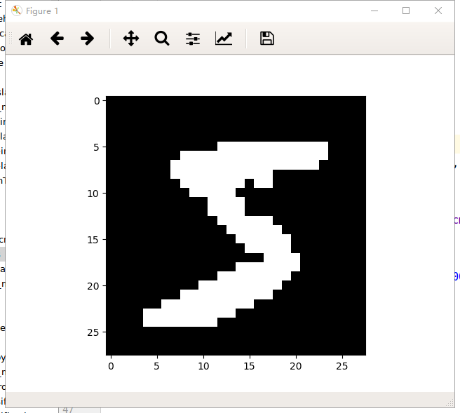
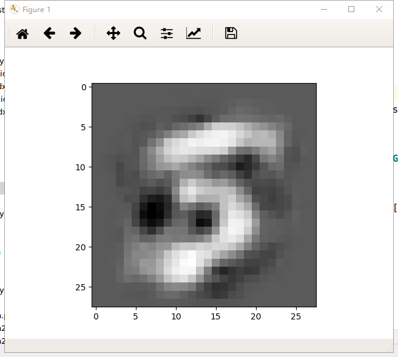
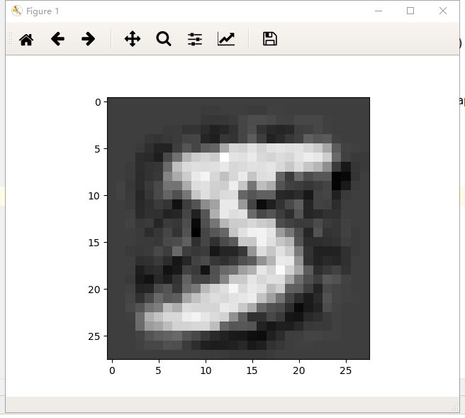
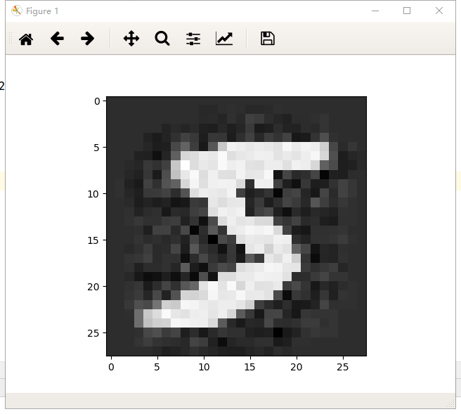
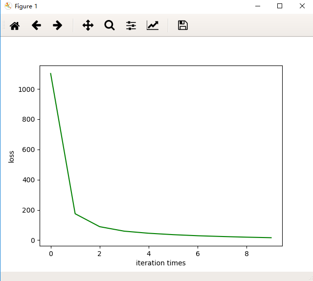
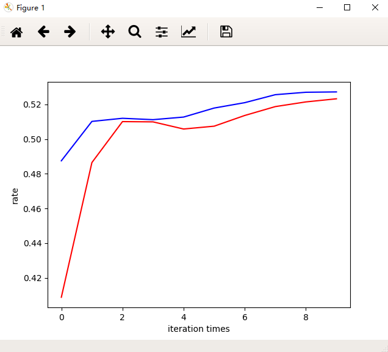
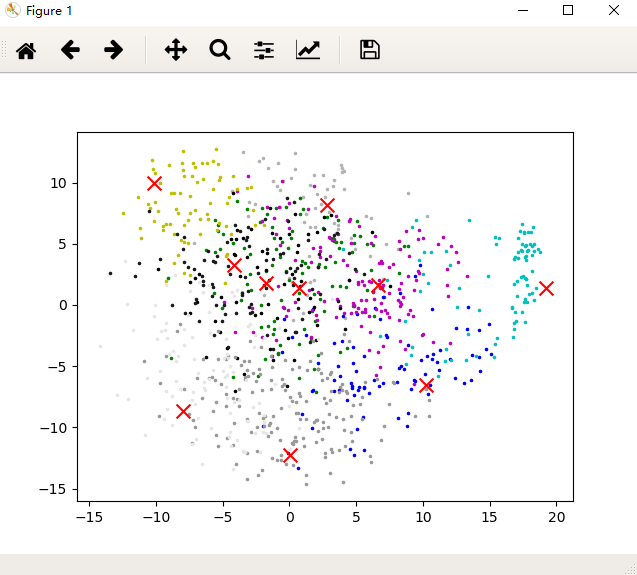
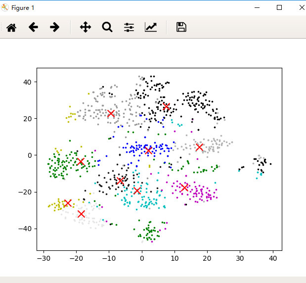

# week5 PCA and K-Means

### **Result is here**

## PCA Reconstruction

Origin

Dim = 20

Dim = 100

Dim = 200

## K-Means Cluster

### Training analyse

LOSS Curve

Train and Validation Accuracy

The blue one is Val curve, the other is Train curve.

Why Train ACC is lower than Val ACC, my opinion is that training dataset has a great number of images but validation dataset doesn't.

## Scatter plot

**PCA** I first using the PCA algorithm to reduct dimension,  obtain top 2 dim and plot

as you can see, the result is poor,  I think that the PCA is not working in dataset with class label, so I change the alogrithm to **TSNE** which is also a alogrithm for dimensionally reduction.

